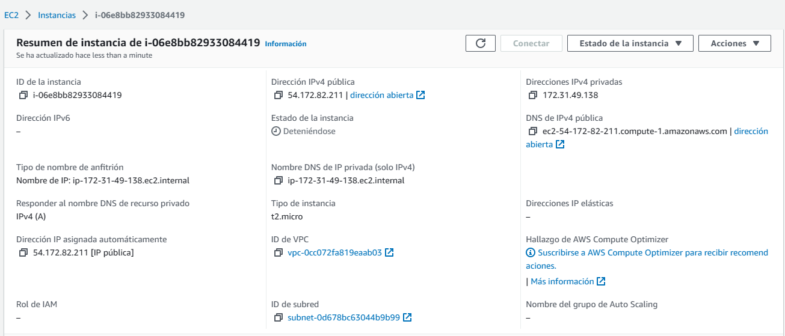
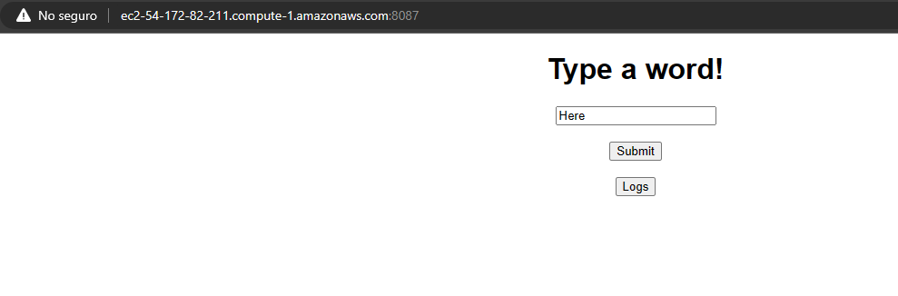
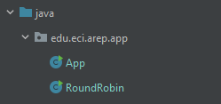

## Escuela Colombiana de Ingeniería
# MODULARIZACIÓN CON VIRTUALIZACIÓN (DOCKER y AWS)

Construir una aplicación con la arquitectura propuesta y desplegarla en AWS usando EC2 y Docker.

1. El servicio MongoDB es una instancia de MongoDB corriendo en un container de docker en una máquina virtual de EC2.

2. LogService es un servicio REST que recibe una cadena, la almacena en la base de datos y responde en un objeto JSON con las 10 últimas cadenas almacenadas en la base de datos y la fecha en que fueron almacenadas.

3. La aplicación web APP-LB-RoundRobin está compuesta por un cliente web y al menos un servicio REST. El cliente web tiene un campo y un botón y cada vez que el usuario envía un mensaje, este se lo envía al servicio REST y actualiza la pantalla con la información que este le regresa en formato JSON. El servicio REST recibe la cadena e implementa un algoritmo de balanceo de cargas de Round Robin, delegando el procesamiento del mensaje y el retorno de la respuesta a cada una de las tres instancias del servicio LogService.

## Clonación del proyecto

Para descargar este proyecto, debe ejecutar el siguiente comando para descargar el proyecto:

```
https://github.com/JuanPablo70/AREP-TALLER05.git
```

### Prerrequisitos

Para hacer uso de esta aplicación debe tener conocimientos de:
+ Java - Lenguaje de programación orientado a objetos.
+ Maven - Herramienta para automatizar la gestión y construcción de proyectos Java. 
+ Docker - Proyecto de código abierto que automatiza el despliegue de aplicaciones dentro de contenedores de software, proporcionando una capa adicional de abstracción y automatización de virtualización de aplicaciones en múltiples sistemas operativos.

### Ejecución de la aplicación

Para ejecutar la aplicación de forma local, se debe primero tener instalado Docker Desktop y ejecutar los siguientes comandos, que son los que crearán las imágenes.

```
docker-compose build

docker-compose up -d
```

Seguido a esto, en la línea de comandos (cmd) ubicarse en la carpeta donde se clonó el proyecto y ejecutar el siguiente comando:

```
mvn clean package exec:java -D "exec.mainClass"="edu.eci.arep.app.App"

mvn clean package exec:java -D "exec.mainClass"="edu.eci.arep.app.RoundRobin"
```

También se puede ejecutar con el siguiente comando sin necesidad de utilizar maven:

```
java -cp target/classes edu.eci.arep.app.App

java -cp target/classes edu.eci.arep.app.RoundRobin
```

Una vez se hayan ejecutado los comandos, ingresar al siguiente enlace http://localhost:4567. 

El proyecto se logró desplegar en una instancia de AWS y para acceder a ella, se debe ingresar el siguiente enlace si la instancia está iniciada.

```
ec2-54-172-82-211.compute-1.amazonaws.com:8087
```

## Test





## Construido con

+ [Maven](https://maven.apache.org/) - Dependency Management
+ [Docker](https://www.docker.com/) - Container Develop

## Versión

1.0

## Autor

Juan Pablo Sánchez Bermúdez

## Descripción del proyecto


Para este diseño, se implementó de la siguiente forma el cliente-servidor en Java.



### RoundRobin

Esta clase tiene los métodos get y post para consultar los datos y se conecta con una instancia de forma aleatoria. Si se desea conectar a con la instancia en AWS, en el atributo url se debe poner la ip privada correspondiente.

### App

Esta clase es la encargada de hacer la conexión a la base de datos en mongo de una imagen de docker lo que permite consultar los datos ingresados por el usuario.

### Dockerfile

Se crearon dos dockerfiles para crear una imagen de App y una de RoundRobin.

### Docker-compose.yml

Se especificó que en este archivo los servicios que se deberían crear, por lo que se crea un servicio web, tres de logs y el de la base de datos.

