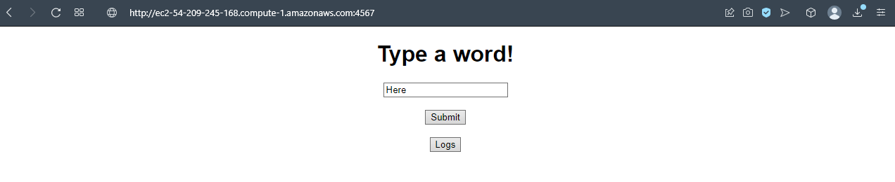

## Escuela Colombiana de Ingeniería
# PATRONES ARQUITECTURALES

Construir una aplicación con la arquitectura propuesta y desplegarla en AWS usando EC2.

1. El servicio MongoDB es una instancia de MongoDB corriendo en un container de docker en una máquina virtual de EC2.

2. LogService es un servicio REST que recibe una cadena, la almacena en la base de datos y responde en un objeto JSON con las 10 últimas cadenas almacenadas en la base de datos y la fecha en que fueron almacenadas.

3. La aplicación web APP-LB-RoundRobin está compuesta por un cliente web y al menos un servicio REST. El cliente web tiene un campo y un botón y cada vez que el usuario envía un mensaje, este se lo envía al servicio REST y actualiza la pantalla con la información que este le regresa en formato JSON. El servicio REST recibe la cadena e implementa un algoritmo de balanceo de cargas de Round Robin, delegando el procesamiento del mensaje y el retorno de la respuesta a cada una de las tres instancias del servicio LogService.

## Clonación del proyecto

Para descargar este proyecto, debe ejecutar el siguiente comando para descargar el proyecto:

```
https://github.com/JuanPablo70/AREP-TALLER06.git
```

### Prerrequisitos

Para hacer uso de esta aplicación debe tener conocimientos de:
+ Java - Lenguaje de programación orientado a objetos.
+ Maven - Herramienta para automatizar la gestión y construcción de proyectos Java. 
+ AWS - Plataforma de computación en la nube.

## Descripción del proyecto

El proyecto estaba diseñado en la arquitectura que se muestra a continuación:


Para este taller se requería aplicar un patrón de arquitectura de la siguiente forma:


En donde el aplicativo web, junto con los logs services y la base de datos en Mongo deben ir cada uno en una instancia aparte.

Para esto, se crearon cinco instancias en AWS:


#### MongoDB

Se instaló [MongoDB](https://www.mongodb.com/docs/manual/tutorial/install-mongodb-on-amazon/) en esta instancia y se configuró su archivo de configuración para que pueda ser accedida por cualquier recurso.

```
sudo nano /etc/mongod.conf
```


```
sudo systemctl status mongod
```


Por último, se agrega una regla de entrada que permita abrir el puerto 27017.

#### LogService

Para las instancias de LogService (1, 2, 3) se instaló [Java 8](https://docs.aws.amazon.com/es_es/corretto/latest/corretto-8-ug/amazon-linux-install.html) ejecutando los siguientes comandos:

```
sudo amazon-linux-extras enable corretto8

sudo yum install java-1.8.0-amazon-corretto-devel
```

Luego se transfirió el directorio target.zip del proyecto a cada instancia, en donde se tuvo que cambiar el puerto en el método ```getPort()``` a 35001, 35002, 35003 respectivamente y cambiar el atributo ```urlDB``` por el DNS de IPv4 pública de la instancia de MongoDB.


```
unzip target.zip
```

Se agregó una regla de entrada al puerto de cada LogService 1, 2, 3 con puertos 35001, 35002, 32003 respectivamente.

#### AppELB

Se instaló Java 8 como se realizó con las intancias de LogService y se cambió el código de la clase ```RoundRobin``` quemando los DNS de IPv4 pública de las instancias de LogService con su respectivo puerto en el atributo ```logs``` y se garantiza el Round Robin, ya que hace la conexión a un LogService aleatorio.

Luego se compila el proyecto y se comprime el target en un archivo .zip y se sube a la instancia AppELB repitiendo los mismos pasos que se hicieron en las instancias de LogService para descomprimir el directorio target.

Se agregó una regla de entrada al puerto 4567 a la instancia.

## Test

Se hicieron pruebas ejecutando el siguiente comando en cada una de las instancias de LogService:

```
java -cp "target/classes:target/dependency/*" edu.eci.arep.app.App
```

Y el siguiente comando en la instancia AppELB:

```
java -cp "target/classes:target/dependency/*" edu.eci.arep.app.RoundRobin
```

En los LogService se debe ver algo así con el DNS de IPv4 pública de cada instancia con su respectivo puerto:

LogService1


LogService2


LogService3


Y en AppELB se debe ver de la siguiente forma:



Se debe poder ingresar una palabra y llamar los logs haciendo clic en el botón Logs.


## Construido con

+ [Maven](https://maven.apache.org/) - Dependency Management
+ [AWS](https://aws.amazon.com/es/) - Cloud Platform

## Versión

1.0

## Autor

Juan Pablo Sánchez Bermúdez
